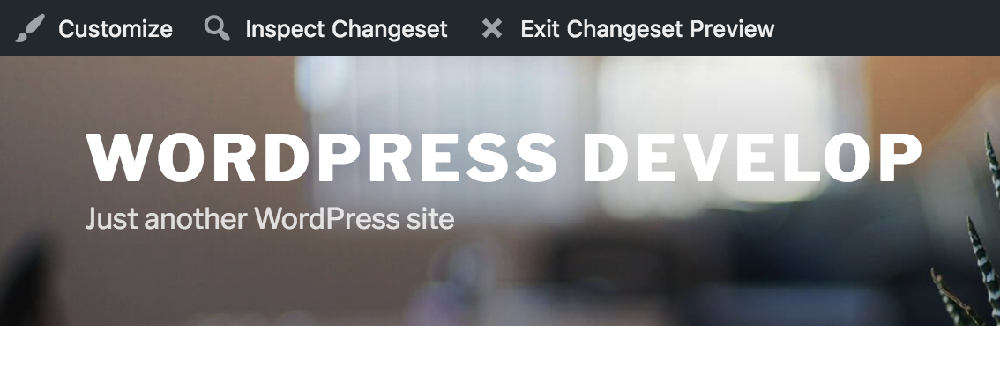
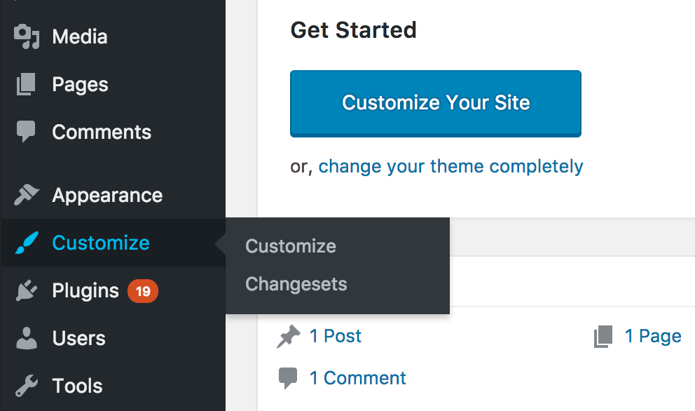
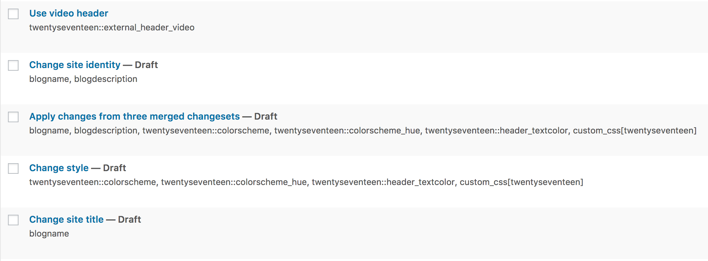
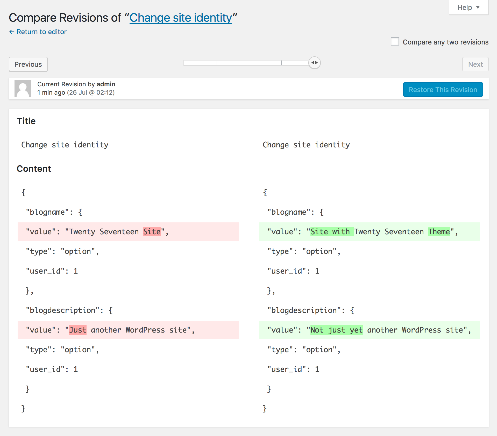
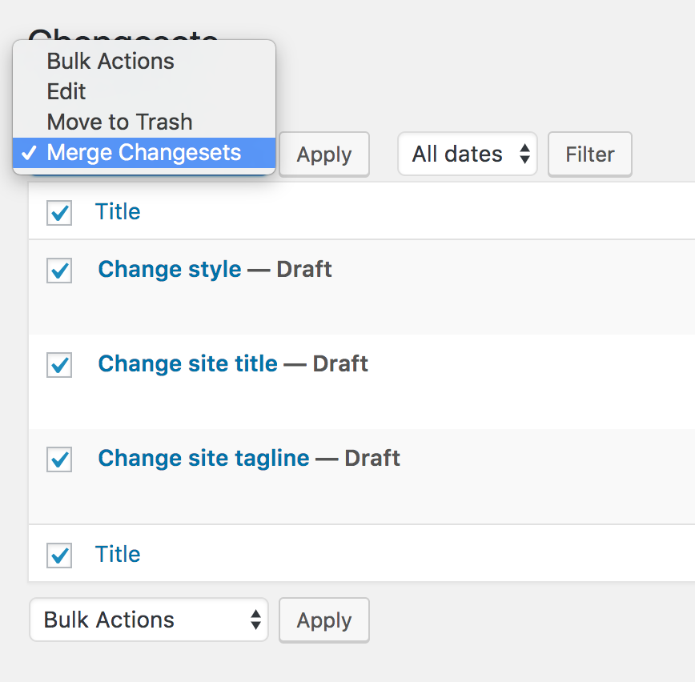

<!-- DO NOT EDIT THIS FILE; it is auto-generated from readme.txt -->
# Customize Snapshots

Provide a UI for managing Customizer changesets; save changesets as named drafts, schedule for publishing; inspect in admin and preview on frontend.

**Contributors:** [xwp](https://profiles.wordpress.org/xwp), [westonruter](https://profiles.wordpress.org/westonruter), [valendesigns](https://profiles.wordpress.org/valendesigns), [utkarshpatel](https://profiles.wordpress.org/utkarshpatel), [sayedwp](https://profiles.wordpress.org/sayedwp), [newscorpau](https://profiles.wordpress.org/newscorpau)  
**Tags:** [customizer](https://wordpress.org/plugins/tags/customizer), [customize](https://wordpress.org/plugins/tags/customize), [changesets](https://wordpress.org/plugins/tags/changesets)  
**Requires at least:** 4.6  
**Tested up to:** 4.8  
**Stable tag:** 0.6.1  
**License:** [GPLv2 or later](http://www.gnu.org/licenses/gpl-2.0.html)  

    

## Description ##

Customize Snapshots save the state of a Customizer session so it can be shared or even published at a future date. A snapshot can be shared with a private URL to both authenticated and non-authenticated users. This means anyone can preview a snapshot's settings on the front-end without loading the Customizer, and authenticated users can load the snapshot into the Customizer and publish or amend the settings at any time.

Snapshots are an implementation of key aspects of the [customizer transactions proposal](https://make.wordpress.org/core/2015/01/26/customizer-transactions-proposal/).

This plugin works well with [Customizer Browser History](https://wordpress.org/plugins/customizer-browser-history/), which ensures that URL in the browser corresponds to the current panel/section/control that is expanded, as well as the current URL and device being previewed.

Requires PHP 5.3+. **Development of this plugin is done [on GitHub](https://github.com/xwp/wp-customize-snapshots). Pull requests welcome. Please see [issues](https://github.com/xwp/wp-customize-snapshots) reported there before going to the [plugin forum](https://wordpress.org/support/plugin/customize-snapshots).**

## Screenshots ##

### The “Save & Publish” button becomes a combo-button that allows you to select the status for the changeset when saving. In addition to publishing, a changeset can be saved as a permanent draft (as opposed to just an auto-draft), pending review, scheduled for future publishing. A revision is made each time you press the button.

### For non-administrator users (who lack the new `customize_publish` capability) the “Publish” button is replaced with a “Submit” button. This takes the changeset and puts it into a pending status.

### When selecting to schedule a changeset, the future publish date can be supplied. Changesets can be supplied a name which serves like a commit message.

### When selecting Publish, a confirmation appears. Additionally, a link is shown which allows you to browse the frontend with the changeset applied

### The admin bar shows information about the current changeset when previewing the changeset on the frontend.

### The Customize link is promoted to the top in the admin menu; a link to list all changesets is also added.

### The Customize link in the admin bar likewise gets a submenu item to link to the changesets post list.

### The Changesets admin screen lists all of the changeset posts that have been saved or published. Row actions provide shortcuts to preview changeset on frontend, open changeset in Customizer for editing, or inspect the changeset's contents on the edit post screen.

### When excerpts are shown in the post list table, the list of settings that are contained in each changeset are displayed.

### Opening a changeset's edit post screen shows which settings are contained in the changeset and what their values are. Settings may be removed from a changeset here. A changeset can also be scheduled or published from here just as one would do for any post, and the settings will be saved once the changeset is published. Buttons are also present to preview the changeset on the frontend and to open the changeset in the Customizer for further revisions.

### Each time a user saves changes to an existing changeset, a new revision will be stored (if revisions are enabled in WordPress). Users' contributions to a given changeset can be inspected here and even reverted prior to publishing.

### Multiple changesets can be merged into a single changeset, allowing multiple users' work to be combined for previewing together and publishing all at once.

## Changelog ##

### 0.6.1 - 2017-07-17 ###
* Fix exception thrown when attempting to activate plugin on Windows environment, or when plugin is in non-standard location. See <a href="https://github.com/xwp/wp-customize-snapshots/issues/105" class="issue-link js-issue-link" data-url="https://github.com/xwp/wp-customize-snapshots/issues/105" data-id="194091302">#105</a>, <a href="https://github.com/xwp/wp-customize-snapshots/pull/139" class="issue-link js-issue-link" data-url="https://github.com/xwp/wp-customize-snapshots/issues/139" data-id="243221610">#139</a>.
* Fix issue with saving <code>option</code> settings when publishing a changeset outside of the Customizer, such as from the edit post admin screen. See <a href="https://github.com/xwp/wp-customize-snapshots/pull/137" class="issue-link js-issue-link" data-url="https://github.com/xwp/wp-customize-snapshots/issues/137" data-id="242616576">#137</a>, <a href="https://github.com/xwp/wp-customize-snapshots/pull/138" class="issue-link js-issue-link" data-url="https://github.com/xwp/wp-customize-snapshots/issues/138" data-id="243123192">#138</a>.

See full commit log: [`0.6.0...0.6.1`](https://github.com/xwp/wp-customize-snapshots/compare/0.6.0...0.6.1)

See [issues and PRs in milestone](https://github.com/xwp/wp-customize-snapshots/milestone/8?closed=1).

### 0.6.0 - 2017-07-06 ###
* Added: Extend, integrate with and defer to changesets in WP 4.7. See <a href="https://github.com/xwp/wp-customize-snapshots/issues/99" class="issue-link js-issue-link" data-url="https://github.com/xwp/wp-customize-snapshots/issues/99" data-id="185500483">#99</a>, <a href="https://github.com/xwp/wp-customize-snapshots/pull/102" class="issue-link js-issue-link" data-url="https://github.com/xwp/wp-customize-snapshots/issues/102" data-id="189592835">#102</a>, <a href="https://github.com/xwp/wp-customize-snapshots/pull/119" class="issue-link js-issue-link" data-url="https://github.com/xwp/wp-customize-snapshots/issues/119" data-id="209975568">#119</a>, <a href="https://github.com/xwp/wp-customize-snapshots/pull/120" class="issue-link js-issue-link" data-url="https://github.com/xwp/wp-customize-snapshots/issues/120" data-id="209979861">#120</a>, <a href="https://github.com/xwp/wp-customize-snapshots/pull/122" class="issue-link js-issue-link" data-url="https://github.com/xwp/wp-customize-snapshots/issues/122" data-id="210213434">#122</a>, <a href="https://github.com/xwp/wp-customize-snapshots/pull/124" class="issue-link js-issue-link" data-url="https://github.com/xwp/wp-customize-snapshots/issues/124" data-id="210397414">#124</a>, <a href="https://github.com/xwp/wp-customize-snapshots/issues/123" class="issue-link js-issue-link" data-url="https://github.com/xwp/wp-customize-snapshots/issues/123" data-id="210248331">#123</a>, <a href="https://github.com/xwp/wp-customize-snapshots/pull/111" class="issue-link js-issue-link" data-id="206025988" title="Ensure that revisions get created when changesets are updated via explicit saves">#111</a>, <a href="https://github.com/xwp/wp-customize-snapshots/issues/108" class="issue-link js-issue-link" data-url="https://github.com/xwp/wp-customize-snapshots/issues/108" data-id="200508804">#108</a>, <a href="https://github.com/xwp/wp-customize-snapshots/issues/112" class="issue-link js-issue-link" data-url="https://github.com/xwp/wp-customize-snapshots/issues/112" data-id="206862695">#112</a>, <a href="https://github.com/xwp/wp-customize-snapshots/pull/127" class="issue-link js-issue-link" data-url="https://github.com/xwp/wp-customize-snapshots/issues/127" data-id="211495205">#127</a>, <a href="https://github.com/xwp/wp-customize-snapshots/issues/131" class="issue-link js-issue-link" data-url="https://github.com/xwp/wp-customize-snapshots/issues/131" data-id="213506857">#131</a>, <a href="https://github.com/xwp/wp-customize-snapshots/pull/132" class="issue-link js-issue-link" data-url="https://github.com/xwp/wp-customize-snapshots/issues/132" data-id="213512349">#132</a>.
* Added: Allow snapshots to be named. See <a href="https://github.com/xwp/wp-customize-snapshots/issues/19" class="issue-link js-issue-link" data-url="https://github.com/xwp/wp-customize-snapshots/issues/19" data-id="151239526">#19</a>, <a href="https://github.com/xwp/wp-customize-snapshots/pull/76" class="issue-link js-issue-link" data-url="https://github.com/xwp/wp-customize-snapshots/issues/76" data-id="171678109">#76</a>.
* Added: Allow multiple snapshots to be merged into a single snapshot. See <a href="https://github.com/xwp/wp-customize-snapshots/issues/67" class="issue-link js-issue-link" data-url="https://github.com/xwp/wp-customize-snapshots/issues/67" data-id="167957640">#67</a>, <a href="https://github.com/xwp/wp-customize-snapshots/pull/92" class="issue-link js-issue-link" data-url="https://github.com/xwp/wp-customize-snapshots/issues/92" data-id="181423950">#92</a>.
* Added: Add hooks to support customize-concurrency plugin. See <a href="https://github.com/xwp/wp-customize-snapshots/pull/87" class="issue-link js-issue-link" data-url="https://github.com/xwp/wp-customize-snapshots/issues/87" data-id="173627962">#87</a>.
* Added: Enable deleting settings in snapshot wp-admin/post page. See <a href="https://github.com/xwp/wp-customize-snapshots/issues/17" class="issue-link js-issue-link" data-url="https://github.com/xwp/wp-customize-snapshots/issues/17" data-id="151236868">#17</a>, <a href="https://github.com/xwp/wp-customize-snapshots/pull/84" class="issue-link js-issue-link" data-url="https://github.com/xwp/wp-customize-snapshots/issues/84" data-id="172899204">#84</a>.
* Added: Remember the preview URL and expanded panel/section when saving a changeset; remember preview url query params. See <a href="https://github.com/xwp/wp-customize-snapshots/issues/107" class="issue-link js-issue-link" data-url="https://github.com/xwp/wp-customize-snapshots/issues/107" data-id="195327448">#107</a>, <a href="https://github.com/xwp/wp-customize-snapshots/pull/129" class="issue-link js-issue-link" data-url="https://github.com/xwp/wp-customize-snapshots/issues/129" data-id="211891590">#129</a>.
* Fixed: Cleanup nav menu created posts if its reference doesn't exists. See <a href="https://github.com/xwp/wp-customize-snapshots/pull/135" class="issue-link js-issue-link" data-url="https://github.com/xwp/wp-customize-snapshots/issues/135" data-id="229881526">#135</a>, <a href="https://github.com/xwp/wp-customize-snapshots/issues/133" class="issue-link js-issue-link" data-url="https://github.com/xwp/wp-customize-snapshots/issues/133" data-id="222183825">#133</a>.
* Fixed: Ensure that revisions get created when changesets are updated via explicit saves.
* Fixed: Add customize as top menu for all user. See <a href="https://github.com/xwp/wp-customize-snapshots/pull/110" class="issue-link js-issue-link" data-url="https://github.com/xwp/wp-customize-snapshots/issues/110" data-id="205838319">#110</a>, <a href="https://github.com/xwp/wp-customize-snapshots/pull/114" class="issue-link js-issue-link" data-url="https://github.com/xwp/wp-customize-snapshots/issues/114" data-id="206963835">#114</a>.
* Fixed: Disable quick edit. See <a href="https://github.com/xwp/wp-customize-snapshots/pull/89" class="issue-link js-issue-link" data-url="https://github.com/xwp/wp-customize-snapshots/issues/89" data-id="174203591">#89</a>, <a href="https://github.com/xwp/wp-customize-snapshots/pull/100" class="issue-link js-issue-link" data-url="https://github.com/xwp/wp-customize-snapshots/issues/100" data-id="185860749">#100</a>.
* Fixed: Timezone issue on compare date. See <a href="https://github.com/xwp/wp-customize-snapshots/pull/97" class="issue-link js-issue-link" data-url="https://github.com/xwp/wp-customize-snapshots/issues/97" data-id="185077507">#97</a>.
* Fixed: Admin footer script hook to support WP 4.5. See <a href="https://github.com/xwp/wp-customize-snapshots/pull/94" class="issue-link js-issue-link" data-url="https://github.com/xwp/wp-customize-snapshots/issues/94" data-id="183030691">#94</a>.
* Fixed: Snapshot publish issue after settings save. See <a href="https://github.com/xwp/wp-customize-snapshots/pull/89" class="issue-link js-issue-link" data-url="https://github.com/xwp/wp-customize-snapshots/issues/89" data-id="174203591">#89</a>.
* Fided: Use non-minified scripts and styles if plugin installed via git (submodule). See <a href="https://github.com/xwp/wp-customize-snapshots/pull/91" class="issue-link js-issue-link" data-url="https://github.com/xwp/wp-customize-snapshots/issues/91" data-id="175166327">#91</a>.
* Fixed: Date handling compatibility with Safari. See <a href="https://github.com/xwp/wp-customize-snapshots/pull/134" class="issue-link js-issue-link" data-url="https://github.com/xwp/wp-customize-snapshots/issues/134" data-id="222253592">#134</a>.

See full commit log: [`0.5.2...0.6.0`](https://github.com/xwp/wp-customize-snapshots/compare/0.5.2...0.6.0)

See [issues and PRs in milestone](https://github.com/xwp/wp-customize-snapshots/milestone/4?closed=1).

Props: Sayed Taqui (<a href="https://github.com/sayedwp" class="user-mention">@sayedwp</a>), Utkarsh Patel (<a href="https://github.com/PatelUtkarsh" class="user-mention">@PatelUtkarsh</a>), Weston Ruter (<a href="https://github.com/westonruter" class="user-mention">@westonruter</a>), Ryan Kienstra (<a href="https://github.com/kienstra" class="user-mention">@kienstra</a>), Luke Gedeon (<a href="https://github.com/lgedeon" class="user-mention">@lgedeon</a>), Derek Herman (<a href="https://github.com/valendesigns" class="user-mention">@valendesigns</a>).

### 0.5.2 - 2016-08-17 ###
* Fixed: Prevent enqueueing frontend JS in the customizer preview. This was erroneously causing the customize_snapshot_uuid param to get injected into links in the preview. See [#80](https://github.com/xwp/wp-customize-snapshots/pull/80).
* Fixed: Ensure that Update button gets disabled and reset to Save once changes have been published. See [#83](https://github.com/xwp/wp-customize-snapshots/pull/83).

See full commit log: [`0.5.1...0.5.2`](https://github.com/xwp/wp-customize-snapshots/compare/0.5.0...0.5.1)

Issues in milestone: [`milestone:0.5.2`](https://github.com/xwp/wp-customize-snapshots/issues?q=milestone%3A0.5.2)

Props: Weston Ruter (<a href="https://github.com/westonruter" class="user-mention">@westonruter</a>), Utkarsh Patel (<a href="https://github.com/PatelUtkarsh" class="user-mention">@PatelUtkarsh</a>)

### 0.5.1 - 2016-08-23 ###
* Added: Pass `Customize_Snapshot` instance as second param to `customize_snapshot_save` filter. See [#77](https://github.com/xwp/wp-customize-snapshots/pull/77).
* Fixed: Restrict user from publishing or scheduling a snapshot unless they can `customize_publish`. See [#74](https://github.com/xwp/wp-customize-snapshots/pull/74).
* Fixed: Fix logic for when to show the snapshot publish error admin notice and show underlying error codes when there are validity errors. See [#79](https://github.com/xwp/wp-customize-snapshots/pull/79).

See full commit log: [`0.5.0...0.5.1`](https://github.com/xwp/wp-customize-snapshots/compare/0.5.0...0.5.1)

Issues in milestone: [`milestone:0.5.1`](https://github.com/xwp/wp-customize-snapshots/issues?q=milestone%3A0.5.1)

Props: Utkarsh Patel (<a href="https://github.com/PatelUtkarsh" class="user-mention">@PatelUtkarsh</a>), Luke Gedeon (<a href="https://github.com/lgedeon" class="user-mention">@lgedeon</a>), Weston Ruter (<a href="https://github.com/westonruter" class="user-mention">@westonruter</a>)

### 0.5.0 - 2016-08-11 ###
Added:

 * Allow snapshot posts to be published from the admin, and thus also scheduled for publication. Customizer settings get saved when a snapshot post transitions to the publish status. If any of the settings are unrecognized or invalid, none of the settings are saved and the status gets kicked back to pending with error messages explaining the problem(s). Published snapshots are considered "locked" and the UI for updating them is hidden, aside from trash. (<a href="https://github.com/xwp/wp-customize-snapshots/issues/15" class="issue-link js-issue-link" data-id="151235522"    title="Allow a snapshot to be scheduled">#15</a>, <a href="https://github.com/xwp/wp-customize-snapshots/pull/62" class="issue-link js-issue-link" data-url="https://github.com/xwp/wp-customize-snapshots/issues/62" data-id="166573576"   >#62</a>, <a href="https://github.com/xwp/wp-customize-snapshots/pull/59" class="issue-link js-issue-link" data-url="https://github.com/xwp/wp-customize-snapshots/issues/59" data-id="164943805"   >#59</a>)
 * Add UI for scheduling for scheduling a snapshot when inside the Customizer. When a future date is selected, the “Save”&nbsp;button becomes “Schedule”. (<a href="https://github.com/xwp/wp-customize-snapshots/pull/68" class="issue-link js-issue-link" data-url="https://github.com/xwp/wp-customize-snapshots/issues/68" data-id="168118044"   >#68</a>)
 * Add link in Customizer to access edit post screen. (<a href="https://github.com/xwp/wp-customize-snapshots/pull/59" class="issue-link js-issue-link" data-url="https://github.com/xwp/wp-customize-snapshots/issues/59" data-id="164943805"   >#59</a>)
 * Add initial read-only REST API endpoints for snapshots. (<a href="https://github.com/xwp/wp-customize-snapshots/pull/63" class="issue-link js-issue-link" data-url="https://github.com/xwp/wp-customize-snapshots/issues/63" data-id="167171939"   >#63</a>, <a href="https://github.com/xwp/wp-customize-snapshots/pull/59" class="issue-link js-issue-link" data-url="https://github.com/xwp/wp-customize-snapshots/issues/59" data-id="164943805"   >#59</a>)
 * Ensure that setting validations are handled in snapshot requests. If any settings are invalid, the snapshot save will be rejected, invoking the same behavior as when attempting to publish invalid settings. (<a href="https://github.com/xwp/wp-customize-snapshots/pull/59" class="issue-link js-issue-link" data-url="https://github.com/xwp/wp-customize-snapshots/issues/59" data-id="164943805"   >#59</a>, <a href="https://github.com/xwp/wp-customize-snapshots/pull/54" class="issue-link js-issue-link" data-url="https://github.com/xwp/wp-customize-snapshots/issues/54" data-id="163427299"   >#54</a>, <a href="https://github.com/xwp/wp-customize-snapshots/issues/31" class="issue-link js-issue-link" data-url="https://github.com/xwp/wp-customize-snapshots/issues/31" data-id="158250613"   >#31</a>)
 * Add link in Customizer to view the snapshot applied to the frontend, adding the <code>customize_snapshot_uuid</code> query param to the current URL being previewed and optioning a new window. (<a href="https://github.com/xwp/wp-customize-snapshots/pull/57" class="issue-link js-issue-link" data-url="https://github.com/xwp/wp-customize-snapshots/issues/57" data-id="164465438"   >#57</a>)
 * Add link in snapshot edit post screen to view snapshot applied to the frontend. (<a href="https://github.com/xwp/wp-customize-snapshots/issues/49" class="issue-link js-issue-link" data-url="https://github.com/xwp/wp-customize-snapshots/issues/49" data-id="159811398"   >#49</a>, <a href="https://github.com/xwp/wp-customize-snapshots/pull/52" class="issue-link js-issue-link" data-url="https://github.com/xwp/wp-customize-snapshots/issues/52" data-id="160765769"   >#52</a>)
 * Add link in Customizer to access the snapshot's edit post admin screen, allowing the snapshot's state to be inspected. (<a href="https://github.com/xwp/wp-customize-snapshots/issues/48" class="issue-link js-issue-link" data-url="https://github.com/xwp/wp-customize-snapshots/issues/48" data-id="159811341"   >#48</a>, <a href="https://github.com/xwp/wp-customize-snapshots/pull/51" class="issue-link js-issue-link" data-url="https://github.com/xwp/wp-customize-snapshots/issues/51" data-id="160758987"   >#51</a>)
 * Inject the <code>customize_snapshot_uuid</code> param into all links when viewing a snapshot on the frontend. This allows the frontend to be browsed as normally with the snapshot context retained. In this mode, the admin bar shows links for returning to the Customizer, for inspecting the snapshot in the admin, and for existing the snapshot preview. If a user happened to navigate to a URL without the snapshot UUID param, then the admin bar will prompt for restoring the snapshot session. (<a href="https://github.com/xwp/wp-customize-snapshots/issues/47" class="issue-link js-issue-link" data-url="https://github.com/xwp/wp-customize-snapshots/issues/47" data-id="159811283"   >#47</a>, <a href="https://github.com/xwp/wp-customize-snapshots/pull/70" class="issue-link js-issue-link" data-url="https://github.com/xwp/wp-customize-snapshots/issues/70" data-id="169773057"   >#70</a>)
 * Inject the current Customizer state into Ajax requests. When viewing a snapshot on the frontend this is done by inserting the <code>customize_snapshot_uuid</code> param into the request via <code>jQuery.ajaxPrefilter</code>. When in the Customizer preview, the Ajax requests are also intercepted by <code>jQuery.ajaxPrefilter</code>: if they are <code>GET</code> they get converted to <code>POST</code> with <code>X-HTTP-Method-Override</code> header added, and the <code>customized</code> data is amended to the request. Requests to the WP REST API, Admin Ajax, and custom endpoints should all have the Customizer state reflected in the responses. (<a href="https://github.com/xwp/wp-customize-snapshots/issues/65" class="issue-link js-issue-link" data-url="https://github.com/xwp/wp-customize-snapshots/issues/65" data-id="167173028"   >#65</a>, <a href="https://github.com/xwp/wp-customize-snapshots/pull/70" class="issue-link js-issue-link" data-url="https://github.com/xwp/wp-customize-snapshots/issues/70" data-id="169773057"   >#70</a>)
 * Also, inject the current Customizer state into form submissions. When viewing a snapshot on the frontend this is done by inserting a <code>customize_snapshot_uuid</code> hidden form input. When in the Customizer preview, forms with a <code>GET</code> method get intercepted and the form data gets serialized and added to the <code>action</code> and then navigated to like a normal link. Forms with <code>POST</code> will continue to no-op when submitted in the Customizer (and their submit buttons will have <code>not-allowed</code> cursor). This fixes a long-standing Trac ticket <a href="https://core.trac.wordpress.org/ticket/20714">#20714</a> “Theme customizer: Impossible to preview a search results page”. (<a href="https://github.com/xwp/wp-customize-snapshots/pull/72" class="issue-link js-issue-link" data-url="https://github.com/xwp/wp-customize-snapshots/issues/72" data-id="170326584"   >#72</a>)

Fixed:

 * Changes to nav menus, nav menu items, and nav menu locations can now be saved to snapshots, previewed on the frontend, and published like other settings in a snapshot. (<a href="https://github.com/xwp/wp-customize-snapshots/issues/2" class="issue-link js-issue-link" data-url="https://github.com/xwp/wp-customize-snapshots/issues/2" data-id="115434987"   >#2</a>, <a href="https://github.com/xwp/wp-customize-snapshots/pull/55" class="issue-link js-issue-link" data-url="https://github.com/xwp/wp-customize-snapshots/issues/55" data-id="163498110"   >#55</a>, <a href="https://github.com/xwp/wp-customize-snapshots/pull/56" class="issue-link js-issue-link" data-url="https://github.com/xwp/wp-customize-snapshots/issues/56" data-id="163769839"   >#56</a>)
 * Refactor codebase, including new <code>Post_Type</code> class. (<a href="https://github.com/xwp/wp-customize-snapshots/pull/59" class="issue-link js-issue-link" data-url="https://github.com/xwp/wp-customize-snapshots/issues/59" data-id="164943805"   >#59</a>)
 * Use <code>customize_refresh_nonces</code> filter to export snapshot nonce. (<a href="https://github.com/xwp/wp-customize-snapshots/pull/59" class="issue-link js-issue-link" data-url="https://github.com/xwp/wp-customize-snapshots/issues/59" data-id="164943805"   >#59</a>)
 * Eliminate <code>generate_snapshot_uuid</code> request by returning new UUID in saving response. (<a href="https://github.com/xwp/wp-customize-snapshots/pull/59" class="issue-link js-issue-link" data-url="https://github.com/xwp/wp-customize-snapshots/issues/59" data-id="164943805"   >#59</a>)
 * Clear up distinction between previewing vs saving values in a snapshot. Remove the <code>can_preview</code> method: only users who have the setting's capability can write to the snapshot, so everyone should be able to freely preview what has been stored there. (<a href="https://github.com/xwp/wp-customize-snapshots/issues/26" class="issue-link js-issue-link" data-url="https://github.com/xwp/wp-customize-snapshots/issues/26" data-id="151753722"   >#26</a>, <a href="https://github.com/xwp/wp-customize-snapshots/pull/59" class="issue-link js-issue-link" data-url="https://github.com/xwp/wp-customize-snapshots/issues/59" data-id="164943805"   >#59</a>)
 * Ensuring that snapshots UI isn't loaded if a theme switch is happening; prevent Save &amp; Activate button from going missing. (<a href="https://github.com/xwp/wp-customize-snapshots/issues/28" class="issue-link js-issue-link" data-url="https://github.com/xwp/wp-customize-snapshots/issues/28" data-id="152663671"   >#28</a>, <a href="https://github.com/xwp/wp-customize-snapshots/pull/59" class="issue-link js-issue-link" data-url="https://github.com/xwp/wp-customize-snapshots/issues/59" data-id="164943805"   >#59</a>)
 * Ensure that <code>get_permalink()</code> returns the frontend URL for the site with the <code>customize_snapshot_uuid</code> param added.

Removed:

* The <code>scope</code> parameter has been removed, as has storing non-<code>dirty</code> settings in a snapshot. (<a href="https://github.com/xwp/wp-customize-snapshots/pull/59" class="issue-link js-issue-link" data-url="https://github.com/xwp/wp-customize-snapshots/issues/59" data-id="164943805"   >#59</a>)

See full commit log: [`0.4.0...0.5.0`](https://github.com/xwp/wp-customize-snapshots/compare/0.4.0...0.5.0)

Issues in milestone: [`milestone:0.5.0`](https://github.com/xwp/wp-customize-snapshots/issues?q=milestone%3A0.5.0)

Props: Weston Ruter (<a href="https://github.com/westonruter" class="user-mention">@westonruter</a>), Utkarsh Patel (<a href="https://github.com/PatelUtkarsh" class="user-mention">@PatelUtkarsh</a>), Derek Herman (<a href="https://github.com/valendesigns" class="user-mention">@valendesigns</a>), Miina Sikk (<a href="https://github.com/miina" class="user-mention">@miina</a>), Sayed Taqui (<a href="https://github.com/sayedwp" class="user-mention">@sayedwp</a>)

### 0.4.0 - 2016-06-11 ###
Added:

* Improved UX by removing save/update dialogs, changing the Snapshot button text to “Save” &amp; “Update” for a more streamlined experience by removing the “full” snapshot option. (Issues <a href="https://github.com/xwp/wp-customize-snapshots/issues/13" class="issue-link js-issue-link" data-url="https://github.com/xwp/wp-customize-snapshots/issues/13" data-id="149683843"   >#13</a>, <a href="https://github.com/xwp/wp-customize-snapshots/issues/42" class="issue-link js-issue-link" data-url="https://github.com/xwp/wp-customize-snapshots/issues/42" data-id="159523365"   >#42</a>, PR <a href="https://github.com/xwp/wp-customize-snapshots/pull/30" class="issue-link js-issue-link" data-url="https://github.com/xwp/wp-customize-snapshots/issues/30" data-id="158083735"   >#30</a>)
* Snapshot UUID is dynamically added to the Customizer URL when a snapshot is first saved and it is stripped from the URL once the settings are published (and the snapshot is published), at which point the snapshot is “frozen”. (Issue <a href="https://github.com/xwp/wp-customize-snapshots/issues/37" class="issue-link js-issue-link" data-url="https://github.com/xwp/wp-customize-snapshots/issues/37" data-id="159311075"   >#37</a>, PR <a href="https://github.com/xwp/wp-customize-snapshots/pull/40" class="issue-link js-issue-link" data-url="https://github.com/xwp/wp-customize-snapshots/issues/40" data-id="159362784"   >#40</a>).
* Update button can now be shift-clicked to open the snapshot on the frontend in a new window.
* Eliminate the storage of non-dirty settings in a Snapshot, which deprecates the <code>scope</code> feature (Issue <a href="https://github.com/xwp/wp-customize-snapshots/issues/42" class="issue-link js-issue-link" data-url="https://github.com/xwp/wp-customize-snapshots/issues/42" data-id="159523365"   >#42</a>)
* Support listing snapshots in the admin and inspecting their contents WP Admin UI, with shortcuts to open snapshot in Customizer, viewing the list of settings contained in a snapshot from the excerpt in post list view (Issue <a href="https://github.com/xwp/wp-customize-snapshots/issues/45" class="issue-link js-issue-link" data-url="https://github.com/xwp/wp-customize-snapshots/issues/45" data-id="159762724"   >#45</a>, PRs <a href="https://github.com/xwp/wp-customize-snapshots/pull/38" class="issue-link js-issue-link" data-url="https://github.com/xwp/wp-customize-snapshots/issues/38" data-id="159336615"   >#38</a>, <a href="https://github.com/xwp/wp-customize-snapshots/pull/46" class="issue-link js-issue-link" data-url="https://github.com/xwp/wp-customize-snapshots/issues/46" data-id="159796414"   >#46</a>).
* Introduce pending snapshots for users who are not administrators (who lack the <code>customize_publish</code> capability) to be able to make snapshots and save them, and then submit them for review once ready (PR <a href="https://github.com/xwp/wp-customize-snapshots/pull/38" class="issue-link js-issue-link" data-url="https://github.com/xwp/wp-customize-snapshots/issues/38" data-id="159336615"   >#38</a>).
* Added revisions for snapshots so that changes to a snapshot made before the time it is published can be tracked.
* New banner image and icon (Issue <a href="https://github.com/xwp/wp-customize-snapshots/issues/24" class="issue-link js-issue-link" data-url="https://github.com/xwp/wp-customize-snapshots/issues/24" data-id="151752405"   >#24</a>, PR <a href="https://github.com/xwp/wp-customize-snapshots/pull/27" class="issue-link js-issue-link" data-url="https://github.com/xwp/wp-customize-snapshots/issues/27" data-id="151762646"   >#27</a>).
* Bumped minimum WordPress version to 4.5.

Fixed:

* Store content in `post_content` instead of `post_content_filtered` (Issue <a href="https://github.com/xwp/wp-customize-snapshots/issues/25" class="issue-link js-issue-link" data-url="https://github.com/xwp/wp-customize-snapshots/issues/25" data-id="151753100"   >#25</a>, PRs <a href="https://github.com/xwp/wp-customize-snapshots/pull/36" class="issue-link js-issue-link" data-url="https://github.com/xwp/wp-customize-snapshots/issues/36" data-id="159058487"   >#36</a>, <a href="https://github.com/xwp/wp-customize-snapshots/pull/43" class="issue-link js-issue-link" data-url="https://github.com/xwp/wp-customize-snapshots/issues/43" data-id="159702836"   >#43</a>). <em>This breaks backwards compatibility with existing snapshots.</em>
* Replace <code>customize-snapshots</code> JS dependency from <code>customize-widgets</code> to <code>customize-controls</code> (PR <a href="https://github.com/xwp/wp-customize-snapshots/pull/14" class="issue-link js-issue-link" data-url="https://github.com/xwp/wp-customize-snapshots/issues/14" data-id="150516750"   >#14</a>).
* Ensure that widget actions and filters are added when previewing snapshots from the front-end (Issue <a href="https://github.com/xwp/wp-customize-snapshots/pull/34" class="issue-link js-issue-link" data-url="https://github.com/xwp/wp-customize-snapshots/issues/34" data-id="158843216"   >#34</a>, PR <a href="https://github.com/xwp/wp-customize-snapshots/issues/33" class="issue-link js-issue-link" data-id="158772746"    title="Ensure that widget actions and filters get added for previewing snapshots for unauthenticated users">#33</a>).
* Use <code>wp_slash()</code> instead of <code>add_magic_quotes()</code> when loading the snapshot post vars (PR <a href="https://github.com/xwp/wp-customize-snapshots/pull/23" class="issue-link js-issue-link" data-url="https://github.com/xwp/wp-customize-snapshots/issues/23" data-id="151289131"   >#23</a>).
* Update <code>dev-lib</code>.

See full commit log: <a href="https://github.com/xwp/wp-customize-snapshots/compare/0.3.1...0.4.0" class="commit-link"><code>0.3.1...0.4.0</code></a> 
Issues/PRs in release: <a href="https://github.com/xwp/wp-customize-snapshots/issues?q=milestone%3A0.4.0"><code>milestone:0.4.0</code></a> 
Props: Weston Ruter (<a href="https://github.com/westonruter" class="user-mention">@westonruter</a>), Derek Herman (<a href="https://github.com/valendesigns" class="user-mention">@valendesigns</a>), Luke Carbis (<a href="https://github.com/lukecarbis" class="user-mention">@lukecarbis</a>)

### 0.3.1 ###
* Fix additional WordPress VIP issues.
* Update `dev-lib`.
* Update Coveralls.

### 0.3.0 ###
* Initialize Snapshots before Widget Posts so that `$wp_customize` will be set on the front-end.
* Fix WordPress VIP PHPCS issues.
* Update `dev-lib`.
* Remove unused button markup in dialog.

### 0.2.1 ###
* Fix AYS confirmation if the snapshot state is saved.
* Register dynamic settings to ensure that snapshot settings are recognized in the post values.
* Slash input for `wp_insert_post()` to prevent loss of slashes.

### 0.2 ###
* Added the `customize_publish` capability.
* Separate "Save" & "Publish" buttons.

### 0.1.1 ###
* Fix widget preview.

### 0.1 ###
* Initial release.

